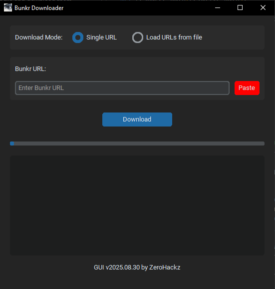
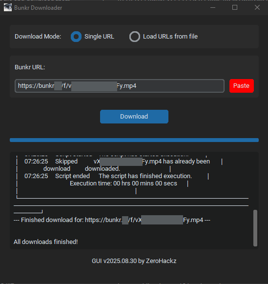
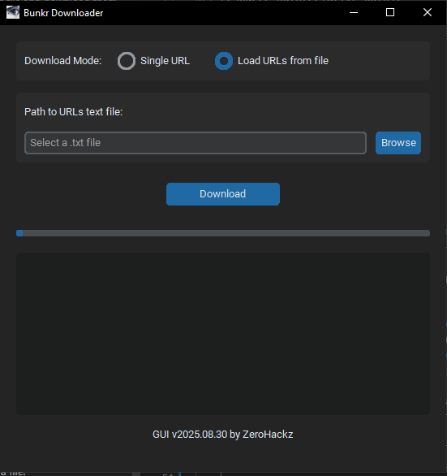
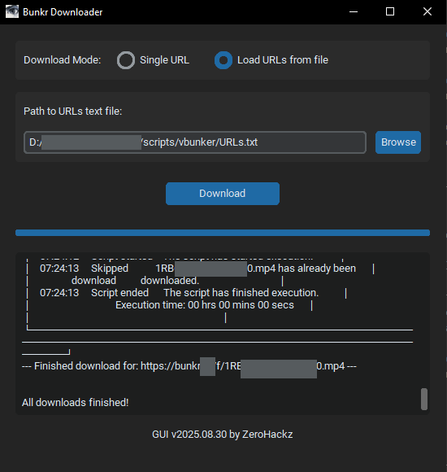

# Bunkr Downloader Portable GUI

This project is a fork of the original [BunkrDownloader by Lysagxra](https://github.com/Lysagxra/BunkrDownloader). Huge thanks to her for creating and maintaining the powerful core of this application!

This version focuses on providing an user-friendly **Graphical User Interface (GUI)** for Windows users and includes other features to make downloading as simple as possible.

### Screenshots
*Screen application `BunkrDownloader-portable-GUI.exe` in single mode.*



*Screen of an completed request interface in single mode `BunkrDownloader-portable-GUI.exe`.*



*Screen application `BunkrDownloader-portable-GUI.exe` in load from file mode.*



*Screen of an completed request interface in load from file mode `BunkrDownloader-portable-GUI.exe`.*



*Real-time download progress and logs.*

## ✨ Features

This fork includes all the powerful core features from the original, plus:

*   **Dual Download Modes:** Easily switch between downloading a single URL or batch downloading from a `.txt` file using a simple toggle.
*   **Graphical User Interface (GUI):** A simple and intuitive interface for downloading. No command line needed!
*   **Portable Windows Executable:** Download and run the application directly without needing to install Python or any dependencies.
*   **Easy URL Pasting:** A convenient "Paste" button to quickly insert a Bunkr URL from your clipboard.
*   **File Browser:** A "Browse" button to easily select your URL list file when in "From File" mode.
*   **Automatic Folder Opening:** Once your download is complete, the folder containing the files will automatically open.
*   **Build & Setup Scripts:** Comes with `.bat` scripts to easily set up the environment and build the executable from source.

### Core Features

- Downloads multiple files from an album concurrently.
- Supports batch downloading via a list of URLs.
- Supports selective file downloading based on filename criteria.
- Provides progress indication during downloads.
- Automatically creates a directory structure for organized storage.
- Logs URLs that encounter errors for troubleshooting.

## 💻 How to Use (Easy Way)

1.  Go to the [**Releases**](https://github.com/ZeroHackz/BunkrDownloader-Portable/releases) page.
2.  Download the latest `BunkrDownloader-portable-GUI.exe` file.
3.  Run the application.
4.  **Choose your download mode:**
    *   **For a single link:** Leave it on "Single URL", paste your Bunkr URL, and click **Download**.
    *   **For multiple links:** Select "From File", click **Browse** to select your `.txt` file, and then click **Download**.
5.  That's it!

## 🛠️ For Developers (Building from Source)

If you want to build the application yourself:

1.  Clone this repository:
    ```bash
    git clone https://github.com/ZeroHackz/BunkrDownloader-Portable.git
    ```
2.  Navigate to the project directory:
    ```bash
    cd BunkrDownloader-Portable
    ```
3.  Run the setup script. This will create a virtual environment and install the required dependencies.
    ```bat
    setup_launcher.bat
    ```
4.  To build the executable, run the build script:
    ```bat
    build.bat
    ```
    The `.exe` will be available in the `dist` folder.

## CLI Usage

The original command-line interface is still available and fully functional.

### Single Download

```bash
python downloader.py <bunkr_url>
```

### Selective & Batch Downloads

All the original flags like `--ignore`, `--include`, and batch downloading via `URLs.txt` are still supported.
 
For more details, please refer to the [Lysagxra README](https://github.com/Lysagxra/BunkrDownloader/blob/main/README.md).

## Logging

The application logs any issues encountered during the download process in a file named `session_log.txt`. Check this file for any URLs that may have been blocked or had errors.
